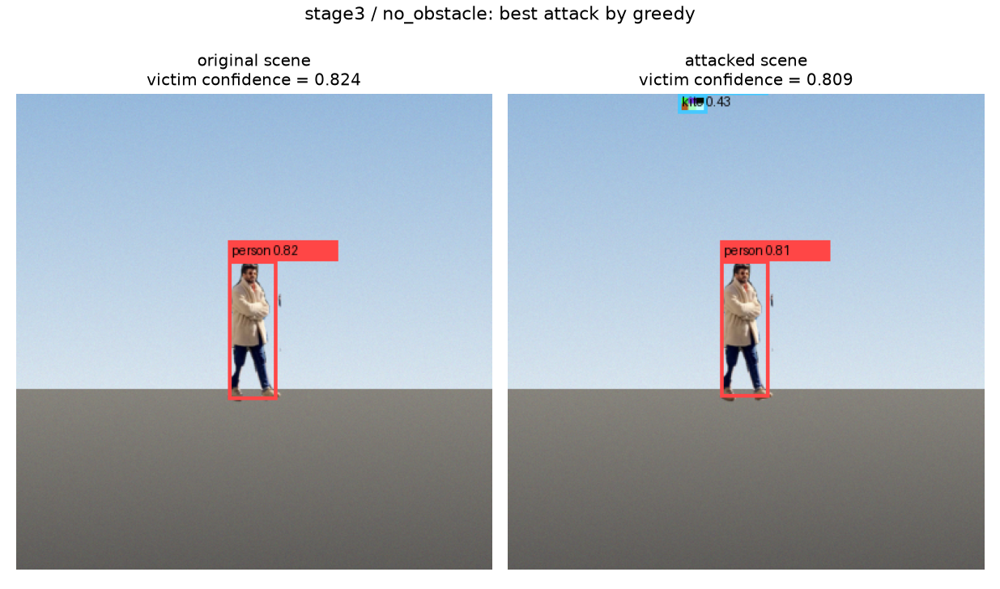
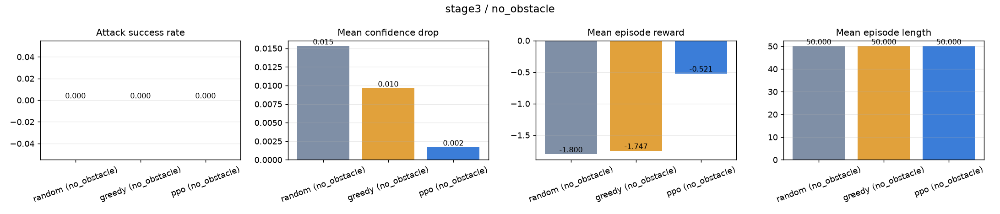
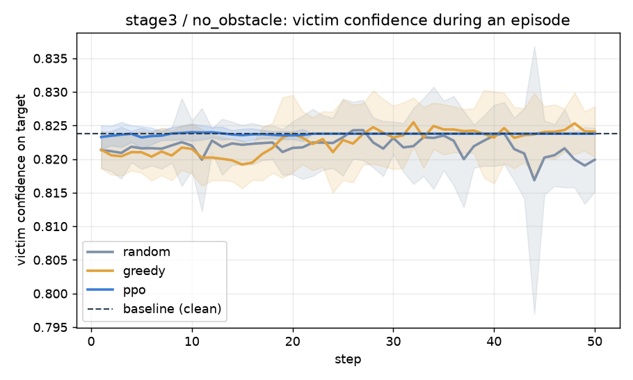
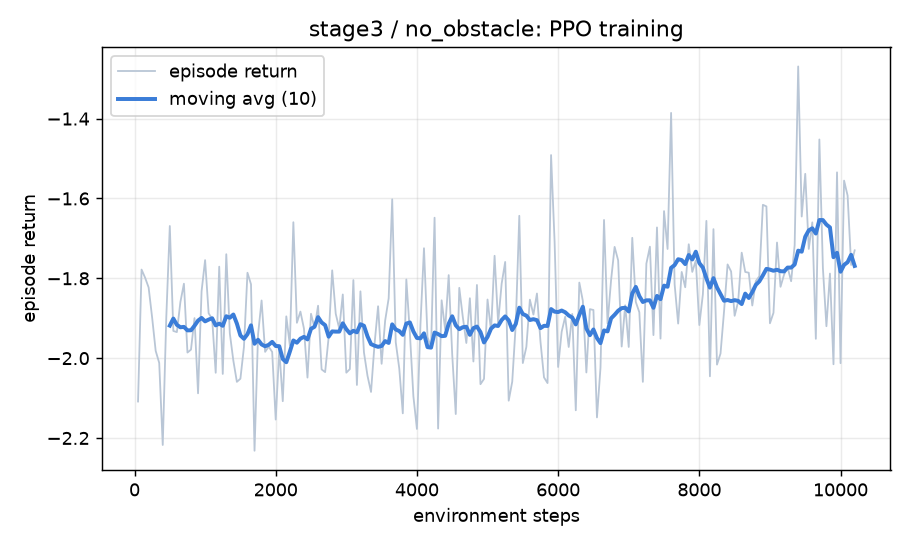
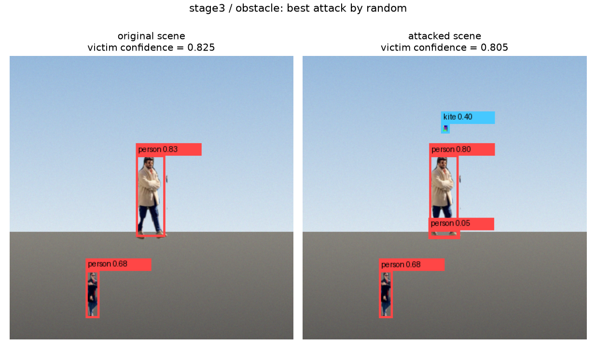
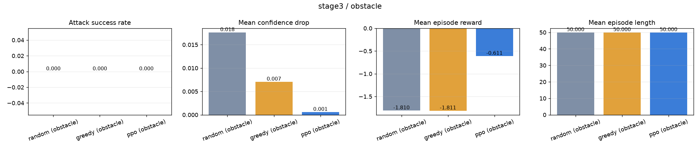
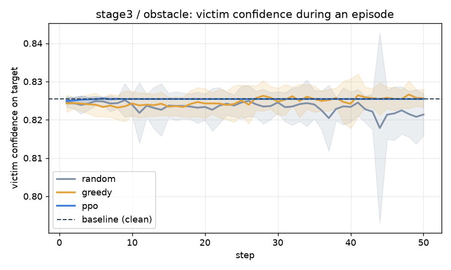
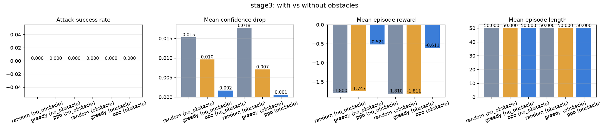
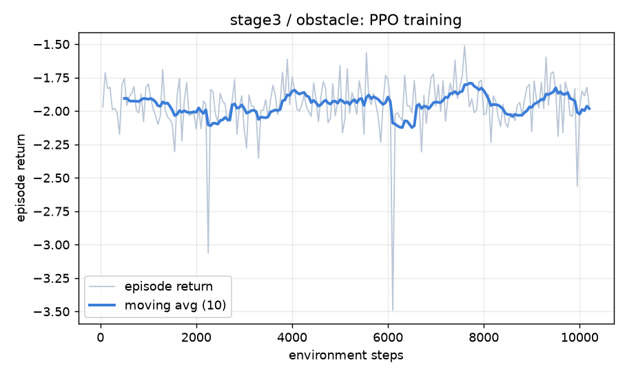

# 實驗結果

由 `scripts/make_report.py` 於 2026-08-10 20:07 UTC 自動產生。

Victim model：`yolo` (`yolov8n.pt`, imgsz=320, conf≥0.05)，frozen，全程不訓練。

Reward（三個 stage 完全相同）：`1.0·confidence_drop − 0.05·movement_cost − 0.25·invalid_action (+1.0 on success，success = confidence < 0.25)`。

---

## Stage 1 · ImageEnvironment（照片、無物理、只有搜尋）

| method | episodes | success rate | conf (clean) | conf (attacked) | conf drop | best conf found | mean reward | move cost | ep length |
| --- | --- | --- | --- | --- | --- | --- | --- | --- | --- |
| random | 300 | 0.000 | 0.883 | 0.877 | 0.006 | 0.726 | 0.006 | 0.00 | 1.0 |
| greedy | 300 | 0.000 | 0.883 | 0.878 | 0.005 | 0.853 | 0.005 | 0.00 | 1.0 |

## Stage 2 · Physics2DEnvironment（推力 + 碰撞，Random / Greedy / PPO）

| method | episodes | success rate | conf (clean) | conf (attacked) | conf drop | best conf found | mean reward | move cost | ep length |
| --- | --- | --- | --- | --- | --- | --- | --- | --- | --- |
| random (no_obstacle) | 25 | 0.000 | 0.905 | 0.889 | 0.016 | 0.867 | -0.959 | 23.45 | 40.0 |
| greedy (no_obstacle) | 25 | 0.000 | 0.905 | 0.895 | 0.011 | 0.872 | -0.643 | 17.12 | 40.0 |
| ppo (no_obstacle) | 25 | 0.000 | 0.905 | 0.898 | 0.007 | 0.896 | -0.036 | 4.99 | 40.0 |
| random (obstacle) | 25 | 0.000 | 0.897 | 0.891 | 0.006 | 0.872 | -1.713 | 21.94 | 40.0 |
| greedy (obstacle) | 25 | 0.000 | 0.897 | 0.886 | 0.010 | 0.866 | -2.165 | 31.95 | 40.0 |
| ppo (obstacle) | 25 | 0.000 | 0.897 | 0.895 | 0.002 | 0.893 | -0.161 | 4.24 | 40.0 |

## Stage 3 · Physics3DEnvironment（同一套 agent，多一個軸）

| method | episodes | success rate | conf (clean) | conf (attacked) | conf drop | best conf found | mean reward | move cost | ep length |
| --- | --- | --- | --- | --- | --- | --- | --- | --- | --- |
| random (no_obstacle) | 20 | 0.000 | 0.824 | 0.808 | 0.015 | 0.731 | -1.800 | 37.94 | 50.0 |
| greedy (no_obstacle) | 20 | 0.000 | 0.824 | 0.814 | 0.010 | 0.797 | -1.747 | 36.11 | 50.0 |
| ppo (no_obstacle) | 20 | 0.000 | 0.824 | 0.822 | 0.002 | 0.818 | -0.521 | 10.47 | 50.0 |
| random (obstacle) | 20 | 0.000 | 0.825 | 0.808 | 0.018 | 0.710 | -1.810 | 37.83 | 50.0 |
| greedy (obstacle) | 20 | 0.000 | 0.825 | 0.818 | 0.007 | 0.798 | -1.811 | 36.43 | 50.0 |
| ppo (obstacle) | 20 | 0.000 | 0.825 | 0.825 | 0.001 | 0.822 | -0.611 | 12.24 | 50.0 |

---

## 最終實驗問題

**Q1 · Agent 是否能透過有限 API 影響 victim model？** 可以。在只有 `observe() / step() / action_space()` 的條件下，搜尋型 agent 把追蹤目標的信心從 0.883 平均壓到 0.877（平均降幅 0.006）。

**Q2 · 加入物理限制後，攻擊成功率如何改變？** Stage 1（可自由放置）最高成功率 0.00；Stage 2（只能推、有速度上限與碰撞）最高成功率 0.00。

**Q3 · PPO 是否優於 Random / Greedy？** 在這個訓練預算下，PPO 優於 baseline：平均 episode reward -0.098 vs -1.370。

**Q4 · 加入 obstacle 後，Agent 是否能適應？** stage2 最高成功率 無障礙 0.00 vs 有障礙 0.00；stage3 最高成功率 無障礙 0.00 vs 有障礙 0.00。

**Q5 · 從 2D 擴展到 3D 時，同一套 Agent / API 設計是否仍然成立？** 成立。Stage 3 原封不動重用 `BaseEnvironment`、`AttackAgent`、`AttackReward`、`run_episodes` 與 `run_physics_stage`，只有 environment 實作與 action 維度不同。

---

## 原始數據

| 檔案 | 內容 |
| --- | --- |
| `results/stage*/episodes.json` | 每個評估 episode 一列 |
| `results/stage*/summary.json` | 每個 method / variant 的彙總指標 |
| `results/stage*/training_curves.json` | PPO 訓練過程的 episode return |
| `results/stage*/ppo_*.zip` | 訓練好的 policy |
| `results/figures/*.png` | 這份報告裡的所有圖 |
