# 實驗結果

由 `scripts/make_report.py` 於 2026-08-09 19:08 UTC 自動產生。

Victim model：`yolo` (`yolov8n.pt`, imgsz=320, conf≥0.05)，frozen，全程不訓練。

Reward（三個 stage 完全相同）：`1.0·confidence_drop − 0.05·movement_cost − 0.25·invalid_action (+1.0 on success，success = confidence < 0.25)`。

---

## Stage 1 · ImageEnvironment（照片、無物理、只有搜尋）

| method | episodes | success rate | conf (clean) | conf (attacked) | conf drop | best conf found | mean reward | move cost | ep length |
| --- | --- | --- | --- | --- | --- | --- | --- | --- | --- |
| random | 300 | 0.013 | 0.856 | 0.822 | 0.034 | 0.000 | 0.043 | 0.10 | 1.0 |
| greedy | 300 | 0.080 | 0.856 | 0.773 | 0.083 | 0.000 | 0.156 | 0.15 | 1.0 |

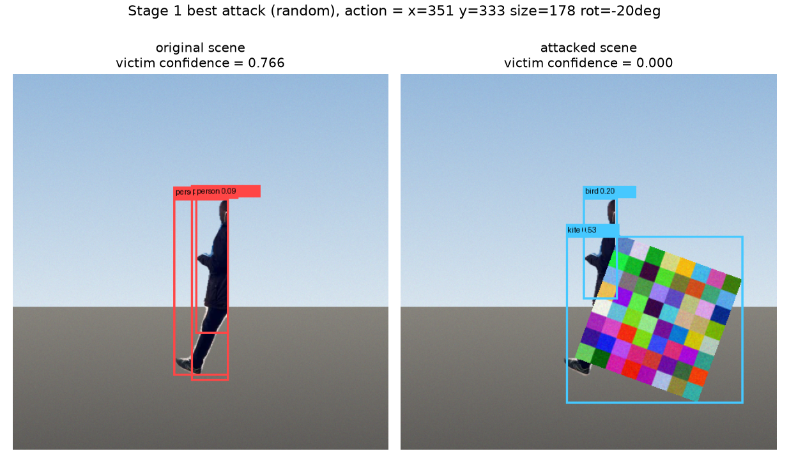

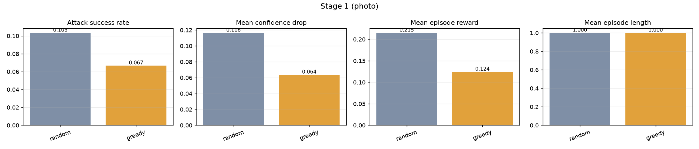

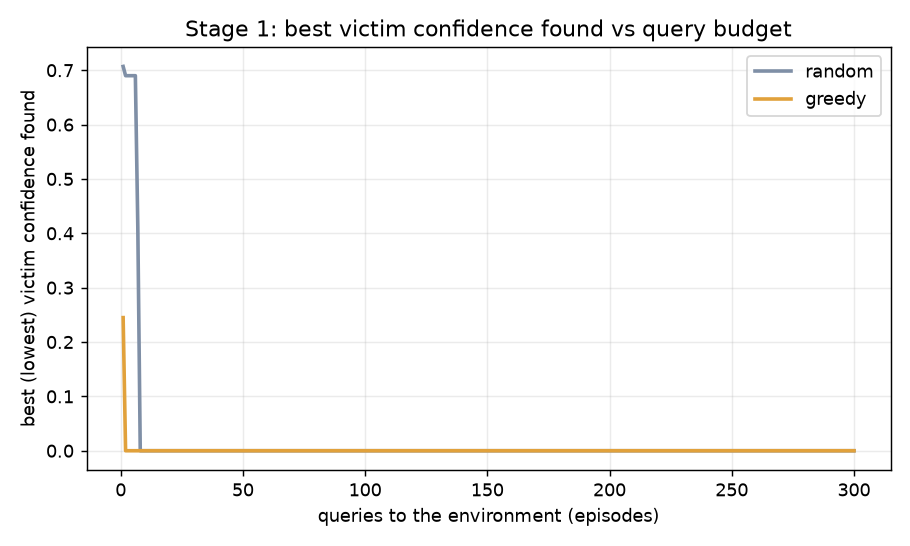

## Stage 2 · Physics2DEnvironment（推力 + 碰撞，Random / Greedy / PPO）

| method | episodes | success rate | conf (clean) | conf (attacked) | conf drop | best conf found | mean reward | move cost | ep length |
| --- | --- | --- | --- | --- | --- | --- | --- | --- | --- |
| random (no_obstacle) | 25 | 0.000 | 0.864 | 0.725 | 0.139 | 0.400 | -0.519 | 25.06 | 40.0 |
| greedy (no_obstacle) | 25 | 0.000 | 0.864 | 0.848 | 0.016 | 0.591 | -1.222 | 23.29 | 40.0 |
| ppo (no_obstacle) | 25 | 0.040 | 0.864 | 0.357 | 0.507 | 0.250 | 8.386 | 18.76 | 40.0 |
| random (obstacle) | 25 | 0.000 | 0.804 | 0.779 | 0.025 | 0.292 | -2.098 | 22.43 | 40.0 |
| greedy (obstacle) | 25 | 0.040 | 0.804 | 0.779 | 0.026 | 0.061 | -1.795 | 19.35 | 40.0 |
| ppo (obstacle) | 25 | 1.000 | 0.804 | 0.000 | 0.804 | 0.000 | 4.650 | 26.83 | 40.0 |

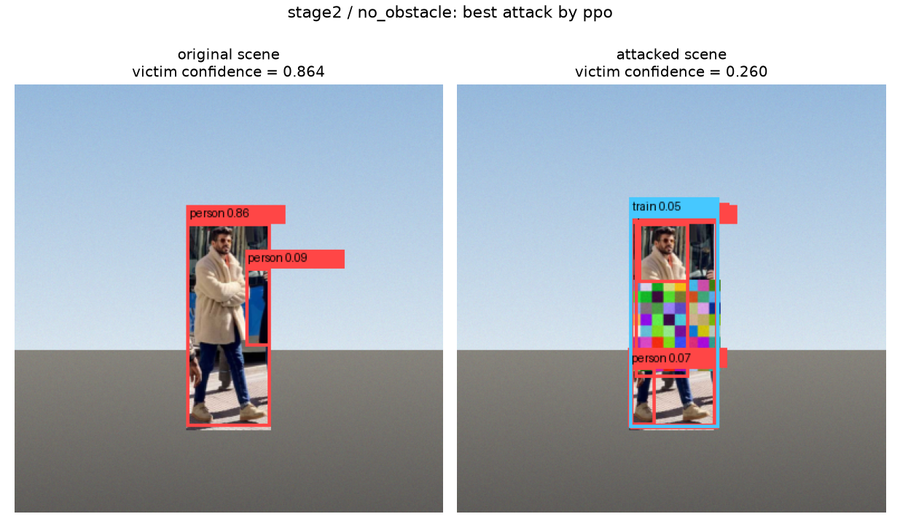

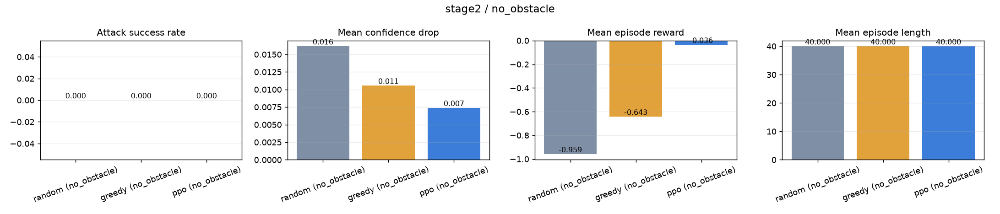

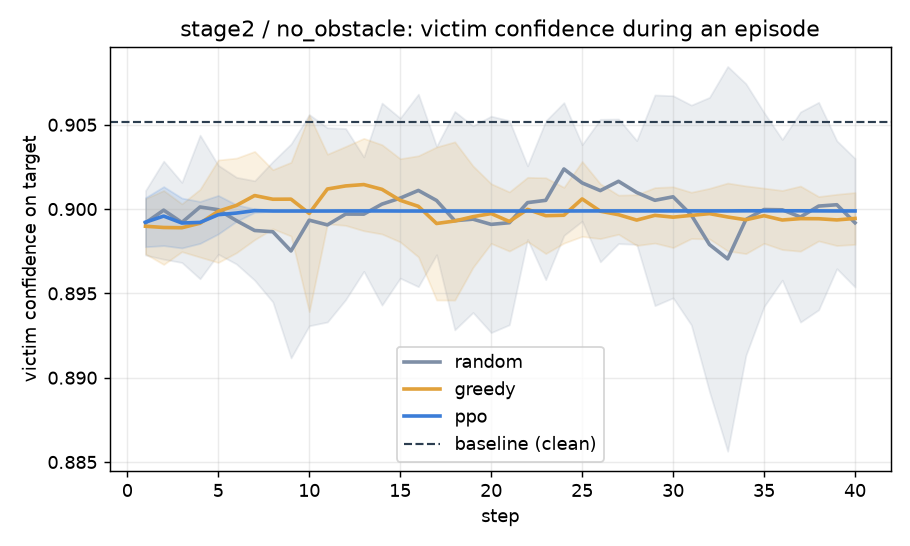

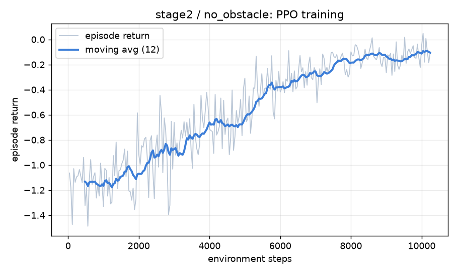

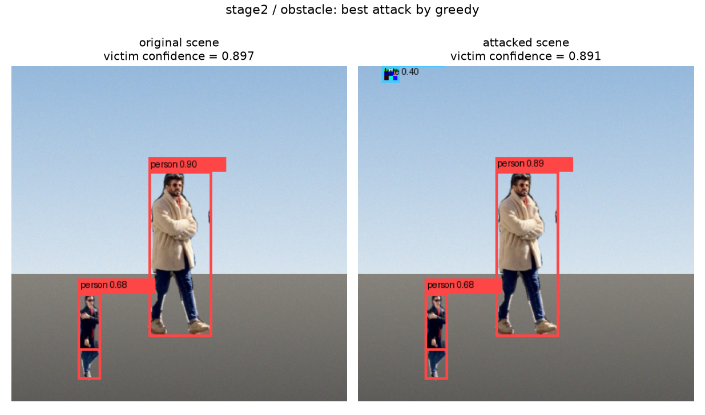

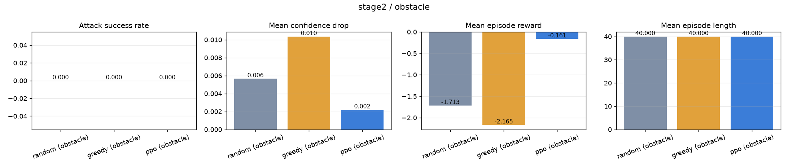

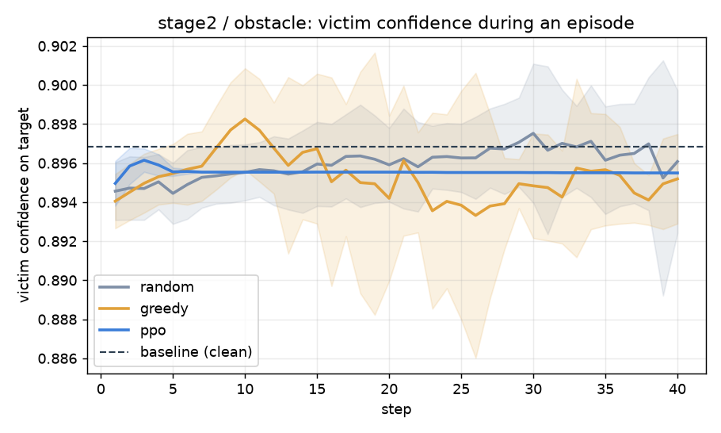

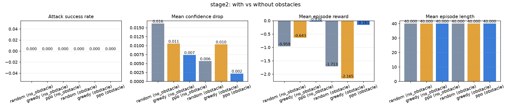

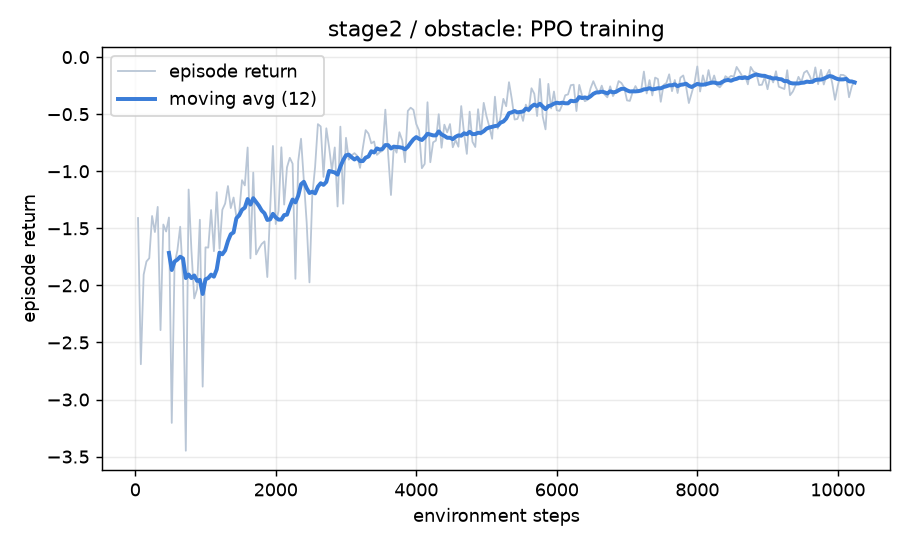

## Stage 3 · Physics3DEnvironment（同一套 agent，多一個軸）

_尚未執行。`uv run python scripts/run_stage3.py`_

---

## 最終實驗問題

**Q1 · Agent 是否能透過有限 API 影響 victim model？** 可以。在只有 `observe() / step() / action_space()` 的條件下，搜尋型 agent 把追蹤目標的信心從 0.856 平均壓到 0.773（平均降幅 0.083）。

**Q2 · 加入物理限制後，攻擊成功率如何改變？** Stage 1（可自由放置）最高成功率 0.08；Stage 2（只能推、有速度上限與碰撞）最高成功率 1.00。

**Q3 · PPO 是否優於 Random / Greedy？** 在這個訓練預算下，PPO 優於 baseline：平均 episode reward +6.518 vs -1.408。

**Q4 · 加入 obstacle 後，Agent 是否能適應？** stage2 最高成功率 無障礙 0.04 vs 有障礙 1.00。

**Q5** — stage 3 尚未執行。

---

## 原始數據

| 檔案 | 內容 |
| --- | --- |
| `results/stage*/episodes.json` | 每個評估 episode 一列 |
| `results/stage*/summary.json` | 每個 method / variant 的彙總指標 |
| `results/stage*/training_curves.json` | PPO 訓練過程的 episode return |
| `results/stage*/ppo_*.zip` | 訓練好的 policy |
| `results/figures/*.png` | 這份報告裡的所有圖 |
